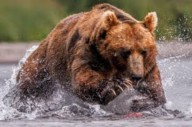

# Github Flavoured Markdown

- ## External Links

  - [GitHub documentation](https://help.github.com/en)

- ## Images (External)

- ## Emojis

  - 🐼 🐈 😉

- ## Link to Images folder

  - [link to images folder](https://github.com/habidbesp/Authoring/tree/main/Images)

- ## Add an Image from your images folder

- ## More Emojis

  - 🐼 🐻 👍

- ## Adding a Table

| Task                                 | Done |
| :----------------------------------- | :--: |
| External Links                       |  ✅  |
| Images (external)                    |  ✅  |
| Emojins                              |  ✅  |
| Link to images folder                |  ✅  |
| Add an image from your images folder |  ✅  |

- ## Checkbox

- [x] External Links 
- [x] Images (external) 
- [x] Emojins
- [x] Link to images folder
- [x] Add an image from your images folder

